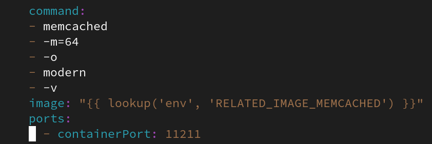

# Building an air-gap friendly operator
By: Adam Goossens



In my [last post](https://www.openshift.com/blog/is-your-operator-air-gap-friendly) I covered what you need to consider to build ‘air-gap friendly’ Operators - Operators that deploy and run cleanly in environments with no internet access of any kind.

In this post I want to take those principles and apply them by converting an existing Operator into an air-gap friendly one. Specifically, we’re going to take the [Memcached example](https://sdk.operatorframework.io/docs/building-operators/ansible/tutorial/) found in the Operator SDK and make it air-gap friendly. I assume that you have been through this tutorial and have built the Memcached Operator and associated bundle, because we'll use this as a basis for our changes.

Throughout this post I will reference my own copy of the Memcached operator, you will need to replace all references to my `quay.io` repository with your own. You'll also see me use `git diff` everywhere; I do this to show you exactly what changes we expect to see in our files.

This will be a walkthrough of the process described in the [OpenShift documentation](https://docs.openshift.com/container-platform/4.7/operators/operator_sdk/osdk-generating-csvs.html#olm-enabling-operator-for-restricted-network_osdk-generating-csvs).

I'll do this with the Ansible version of the Memcached Operator example, but these concepts are applicable to any other kind of Operator too - Helm-based, Golang-based, or Operators in any language. 

## Ok, let's diagnose the problem

Let’s do a lightning fast recap what we need for minimum air-gap friendliness - remember, think **NIRDD**:

* **N**ever hardcode Internet URLs - this includes container image references.
* **I**nject trusted certificates.
* **R**elated images should be listed in the ClusterServiceVersion.
* **D**igests, not tags - so we can take advantage of the ‘oc’ tool mirroring capabilities.
* **D**ocumentation - a list of which images need to be mirrored to the air-gapped environments.

The current Memcached example doesn’t meet *any* of these requirements: the memcached image reference is hard coded into the `Deployment`, it references that image by tag, and there’s no documentation of which containers to mirror.

In this article we’ll focus on the N, R and first D - removing hardcoded references, listing related images, and converting to digests instead of tags. We skip trusted certificates, as they're not an issue here. I'll leave documentation as an exercise for the reader :)

Let’s do it!

## Step 1: no more hardcoded image references

Let’s start by no longer hardcoding the container image into the Deployment. We’ll amend `roles/memcached/tasks/main.yml` to accept a container image through environment variables, like so:

```
diff --git a/roles/memcached/tasks/main.yml b/roles/memcached/tasks/main.yml
index 6203332..0738f14 100644
--- a/roles/memcached/tasks/main.yml
+++ b/roles/memcached/tasks/main.yml
@@ -25,6 +25,6 @@
               - -o
               - modern
               - -v
-              image: "docker.io/memcached:1.4.36-alpine"
+              image: "{{ lookup('env', 'RELATED_IMAGE_MEMCACHED') }}"
               ports:
                 - containerPort: 11211
```

We have replaced the hardcoded image with a reference to the `RELATED_IMAGE_MEMCACHED` environment variable. That's step 1 complete, but for a more complex operator you would want to replace *every* `image:` reference with an environment variable lookup.

## Step 2: inject the environment variable

The `RELATED_IMAGE_MEMCACHED` environment variable needs to be passed to the Operator pod that is started by OLM. To do this we'll adjust the Kustomization resource for the Operator's `Deployment`.

We need to adjust `config/manager/manager.yaml` to include a definition of this environment variable:

```
diff --git a/config/manager/manager.yaml b/config/manager/manager.yaml
index 63fa347..a3e25ce 100644
--- a/config/manager/manager.yaml
+++ b/config/manager/manager.yaml
@@ -33,6 +33,8 @@ spec:
         env:
         - name: ANSIBLE_GATHERING
           value: explicit
+        - name: RELATED_IMAGE_MEMCACHED
+          value: 'docker.io/memcached:1.4.36-alpine'
         securityContext:
           allowPrivilegeEscalation: false
         livenessProbe:
```

So far, so good. Let's regenerate the bundle:

```
$ IMAGE_TAG_BASE=quay.io/agoossen/memcached-operator VERSION=0.0.1 make bundle
```

We can see that `bundle/manifests/memcached-operator.clusterserviceversion.yaml` now includes our amended `Deployment` with the environment variable injected.

Next we turn our focus onto the `spec.relatedImages` field of our Operator's `ClusterServiceVersion`, which is still missing.

## Step 2.5: change the kube-rbac-proxy image for OCP 4.7 and 4.6.latest

Unfortunately there is a bug with using the default `gcr.io/kubebuilder/kube-rbac-proxy:v0.8.0` image on OpenShift 4.7 and later version of 4.6. It will cause deployment of the container to fail with a `CreateContainerError`. This is the associated [GitHub issue](https://github.com/operator-framework/operator-sdk/issues/4684).

To fix this, you need to use the image `registry.redhat.io/openshift4/ose-kube-rbac-proxy:v4.7` in place of the default RBAC proxy image. We can do that by changing `config/default/manager_auth_proxy_patch.yaml`:

```
diff --git a/config/default/manager_auth_proxy_patch.yaml b/config/default/manager_auth_proxy_patch.yaml
index fabc206..0ee8500 100644
--- a/config/default/manager_auth_proxy_patch.yaml
+++ b/config/default/manager_auth_proxy_patch.yaml
@@ -10,7 +10,7 @@ spec:
     spec:
       containers:
       - name: kube-rbac-proxy
-        image: gcr.io/kubebuilder/kube-rbac-proxy:v0.8.0
+        image: registry.redhat.io/openshift4/ose-kube-rbac-proxy:v4.7
         args:
         - "--secure-listen-address=0.0.0.0:8443"
         - "--upstream=http://127.0.0.1:8080/"
```

## Step 3: list out the related images

The `operator-sdk` command will not produce a `relatedImages` section for you, so you need to again adjust the Kustomization templates that form the base of the `ClusterServiceVersion`.

For completeness we are going to list **three** related images - these are all listed in `bundle/manifests/memcached-operator.clusterserviceversion.yaml`:

* The Operator image itself (`quay.io/agoossen/memcached-operator:0.0.1`).
* The Memcached image referenced in the `RELATED_IMAGES_MEMCACHED` environment variable (`docker.io/memcached:1.4.36-alpine`).
* The `kube-rbac-proxy` container (`registry.redhat.io/openshift4/ose-kube-rbac-proxy:v4.7`).

We need to adjust `config/manifests/bases/memcached-operator.clusterserviceversion.yaml` like so:

```
diff --git a/config/manifests/bases/memcached-operator.clusterserviceversion.yaml b/config/manifests/bases/memcached-operator.clusterserviceversion.yaml
index dad99f7..65adaba 100644
--- a/config/manifests/bases/memcached-operator.clusterserviceversion.yaml
+++ b/config/manifests/bases/memcached-operator.clusterserviceversion.yaml
@@ -36,4 +36,11 @@ spec:
   maturity: alpha
   provider:
     name: Your Name Here
+  relatedImages:
+  - image: docker.io/memcached:1.4.36-alpine
+    name: memcached-1.4.36
+  - image: registry.redhat.io/openshift4/ose-kube-rbac-proxy:v4.7
+    name: ose-kube-rbac-proxy-v4.7
+  - image: quay.io/agoossen/memcached-operator:0.0.1
+    name: memcached-operator-0.0.1
   version: 0.0.0
```

Regenerate the bundle manifests using `make bundle` and the ClusterServiceVersion under `bundle/manifests` now includes the relatedImages field, as expected.

```
$ IMAGE_TAG_BASE=quay.io/agoossen/memcached-operator VERSION=0.0.1 make bundle
$ git diff bundle/manifests
diff --git a/bundle/manifests/memcached-operator.clusterserviceversion.yaml b/bundle/manifests/memcached-operator.clusterserviceversion.yaml
index edb589b..2da2436 100644
--- a/bundle/manifests/memcached-operator.clusterserviceversion.yaml
+++ b/bundle/manifests/memcached-operator.clusterserviceversion.yaml
@@ -112,7 +112,7 @@ spec:
                 - --upstream=http://127.0.0.1:8080/
                 - --logtostderr=true
                 - --v=10
-                image: gcr.io/kubebuilder/kube-rbac-proxy:v0.8.0
+                image: registry.redhat.io/openshift4/ose-kube-rbac-proxy:v4.7
                 name: kube-rbac-proxy
                 ports:
                 - containerPort: 8443
@@ -195,4 +195,8 @@ spec:
   relatedImages:
   - image: docker.io/memcached:1.4.36-alpine
     name: memcached-1.4.36
+  - image: registry.redhat.io/openshift4/ose-kube-rbac-proxy:v4.7
+    name: ose-kube-rbac-proxy-v4.7
+  - image: quay.io/agoossen/memcached-operator:0.0.1
+    name: memcached-operator-0.0.1
   version: 0.0.1
```

Unfortunately, we've still got tags throughout. Let's replace them with digests.

## Step 4: Digests, not tags

We need to go through the ClusterServiceVersion and convert all tag-based references to images into a corresponding digest-based reference. 

For simplicity I'll use a small bash script that will do the work for me. It will:

* Split the reference into an image base and a tag.
* Use `skopeo inspect` to find the digest, and `jq` to return it.
* Use `sed` to replace all occurrences of that `image:tag` combination with `image@digest` instead.

The script will do this for each of the three images we listed in relatedImages. A more mature script would use relatedImages as a 'source of truth' for what references to search/replace, but that's beyond the scope of this article:

```
# tags-to-digest.sh
for img in docker.io/memcached:1.4.36-alpine quay.io/agoossen/memcached-operator:0.0.1 registry.redhat.io/openshift4/ose-kube-rbac-proxy:v4.7
do 
  base=`echo $img | cut -f 1 -d':'`
  tag=`echo $img | cut -f 2 -d':'`
  digest_json=`skopeo inspect docker://$base:$tag`
  if [ $? -gt 0 ]
  then
    echo "Failed to inspect image $base:$tag; skipping"
  else
    digest=`echo $digest_json | jq '.Digest' -r`
    echo "$base:$tag becomes $base@$digest."
    sed -i "s#$base:$tag#$base@$digest#g" bundle/manifests/memcached-operator.clusterserviceversion.yaml
  fi
done
```

Running it results in the following output:

```
$ ./tags-to-digest.sh
docker.io/memcached:1.4.36-alpine becomes docker.io/memcached@sha256:00b68b00139155817a8b1d69d74865563def06b3af1e6fc79ac541a1b2f6b961.
quay.io/agoossen/memcached-operator:0.0.1 becomes quay.io/agoossen/memcached-operator@sha256:c39c9ca4ab316a3173dc1f3ad391314c6bef4d94d084469b82c29d954b26df80.
registry.redhat.io/openshift4/ose-kube-rbac-proxy:v4.7 becomes registry.redhat.io/openshift4/ose-kube-rbac-proxy@sha256:1fee9f7563afd0878288d60dce2c263a6333b18b40d88898ed0fca92e6e7048f.
```

Sure enough, a quick diff on `bundle/manifests/memcached-operator.clusterserviceversion.yaml` shows all tags replaced by digests:

```
$ git diff bundle/manifests
diff --git a/bundle/manifests/memcached-operator.clusterserviceversion.yaml b/bundle/manifests/memcached-operator.clusterserviceversion.yaml
index edb589b..b44faff 100644
--- a/bundle/manifests/memcached-operator.clusterserviceversion.yaml
+++ b/bundle/manifests/memcached-operator.clusterserviceversion.yaml
@@ -112,7 +112,7 @@ spec:
                 - --upstream=http://127.0.0.1:8080/
                 - --logtostderr=true
                 - --v=10
-                image: gcr.io/kubebuilder/kube-rbac-proxy:v0.8.0
+                image: registry.redhat.io/openshift4/ose-kube-rbac-proxy@sha256:1fee9f7563afd0878288d60dce2c263a6333b18b40d88898ed0fca92e6e7048f
                 name: kube-rbac-proxy
                 ports:
                 - containerPort: 8443
@@ -127,8 +127,8 @@ spec:
                 - name: ANSIBLE_GATHERING
                   value: explicit
                 - name: RELATED_IMAGE_MEMCACHED
-                  value: docker.io/memcached:1.4.36-alpine
-                image: quay.io/agoossen/memcached-operator:0.0.1
+                  value: docker.io/memcached@sha256:00b68b00139155817a8b1d69d74865563def06b3af1e6fc79ac541a1b2f6b961
+                image: quay.io/agoossen/memcached-operator@sha256:c39c9ca4ab316a3173dc1f3ad391314c6bef4d94d084469b82c29d954b26df80
                 livenessProbe:
                   httpGet:
                     path: /healthz
@@ -193,6 +193,10 @@ spec:
   provider:
     name: Your Name Here
   relatedImages:
-  - image: docker.io/memcached:1.4.36-alpine
+  - image: docker.io/memcached@sha256:00b68b00139155817a8b1d69d74865563def06b3af1e6fc79ac541a1b2f6b961
     name: memcached-1.4.36
+  - image: registry.redhat.io/openshift4/ose-kube-rbac-proxy@sha256:1fee9f7563afd0878288d60dce2c263a6333b18b40d88898ed0fca92e6e7048f
+    name: ose-kube-rbac-proxy-v4.7
+  - image: quay.io/agoossen/memcached-operator@sha256:c39c9ca4ab316a3173dc1f3ad391314c6bef4d94d084469b82c29d954b26df80
+    name: memcached-operator-0.0.1
```

## Step 5: add the disconnected annotation

Last but not least, we should add the annotation `operators.openshift.io/infrastructure-features: '["disconnected"]'` to our `ClusterServiceVersion` to announce to the OperatorHub that the Operator runs in disconnected environments:

```
diff --git a/config/manifests/bases/memcached-operator.clusterserviceversion.yaml b/config/manifests/bases/memcached-operator.clusterserviceversion.yaml
index dad99f7..bf1a16f 100644
--- a/config/manifests/bases/memcached-operator.clusterserviceversion.yaml
+++ b/config/manifests/bases/memcached-operator.clusterserviceversion.yaml
@@ -4,6 +4,7 @@ metadata:
   annotations:
     alm-examples: '[]'
     capabilities: Basic Install
+    operators.openshift.io/infrastructure-features: '["disconnected"]'
   name: memcached-operator.v0.0.0
   namespace: placeholder
 spec:
```

Re-generate the bundle with `make bundle`, re-run `tags-to-images.sh`, and we're done.

## Wrapping up our air-gap friendly Memcached operator

From here we build and push the Operator bundle image using `make bundle-build bundle-push`. We could then generate a catalog image using the [instructions here](https://docs.openshift.com/container-platform/4.7/operators/admin/olm-managing-custom-catalogs.html#olm-managing-custom-catalogs), and transfer that into the disconnected environment along with our Operator and it's related images.

Ok, let's recap. We started with the memcached operator that the operator-sdk Ansible tutorial takes us through. To make it ‘air-gap friendly’, we then:

* Removed the hardcoded memcached image reference in the Deployment, replacing it with an environment variable supplied to the operator container.
* Updated the Kustomize templates to pass the environment variable to the operator container.
* Created a `spec.relatedImages` section in the ClusterServiceVersion with three required images - kube-rbac-proxy, the operator image, and the memcached image.
* Replaced our tag-based references with digest-based references, using `skopeo inspect` and a small script.
* Annotated our `ClusterServiceVersion` to mark our Operator as being suitable for disconnected environments.

If I was going to improve this further, I'd build the `spec.relatedImages` section automatically. You could do this by parsing the `ClusterServiceVersion`, looking at each environment variable passed to all containers in the `Deployment`, then processing those that start with `RELATED_IMAGE_` into the `spec.relatedImages` field. Of course, that's an exercise for the reader :)

Hopefully this article has given you some hands on, although admittedly small, practice in building an air-gap friendly Operator. Good luck!
